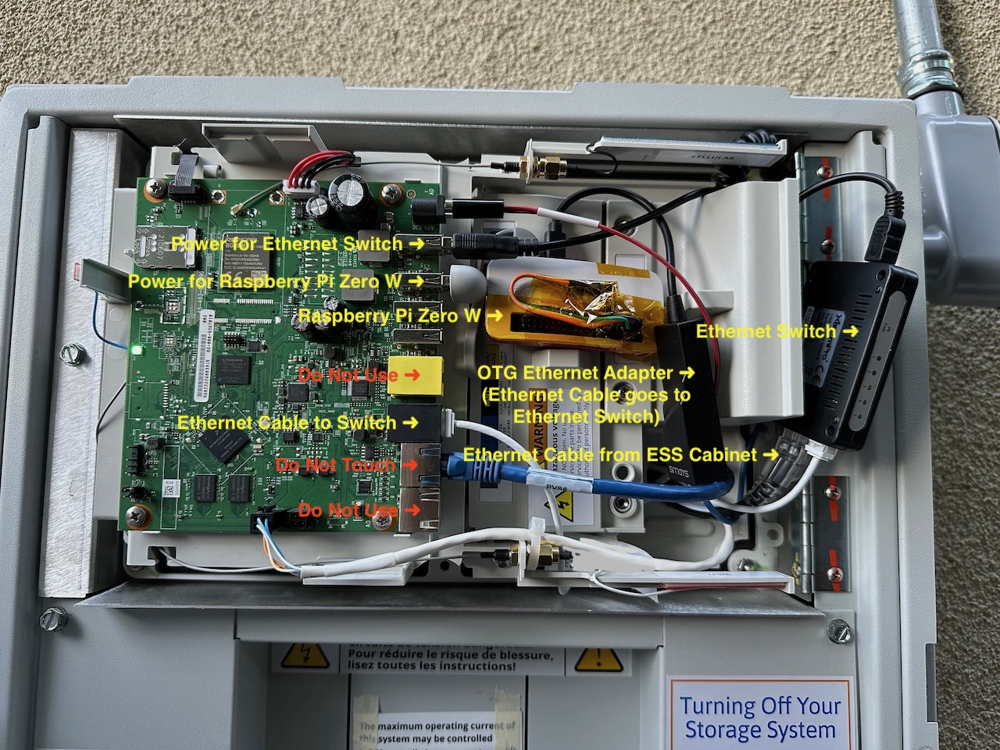

# sunpower-ess-monitor
Monitors a SunPower ESS system, publishing metrics to a MQTT broker

# Hardware Requirements
- SunPower ESS System (Hub+ cabinet plus one or more ESS cabinets)
- [USB-powered Ethernet switch](https://amzn.to/3HBLvx3)
- Raspberry Pi Zero W (recommended due to low power draw and small form factor)
- [Raspberry Pi Zero W Case](https://amzn.to/3ZrGY87)
- [OTG Micro USB Ethernet adapter](https://amzn.to/3JEhAqQ)
- [Two short Ethernet cables](https://amzn.to/3laA34a)
- [One short USB-A to Micro USB power cable](https://amzn.to/3YmEtTM)
- [Micro SD card](https://amzn.to/3wZ22X0)
- [Torx T20 screwdriver](https://amzn.to/3JjfFay)
# Software Requirements
- MQTT broker, such as [Eclipse Mosquitto](https://mosquitto.org/download/)

# Installation

## Install and configure Raspberry Pi OS
- Install a fresh Raspberry Pi image onto the micro SD card using [Raspberry Pi Imager](https://www.raspberrypi.com/documentation/computers/getting-started.html)
  - Installing a headless image (Raspberry Pi OS Lite) is fine, since we will only be connecting via SSH
  - Click the gear icon to adjust these settings:
    - Set the hostname to `sunpower-ess-monitor`
    - Enable SSH access
    - Set username to `pi` and specify a password
    - Configure wireless LAN with your WiFi router SSID, password, and country
    - Set locale settings to your time zone and keyboard layout
- After you burn the OS image onto the SD card, eject it and install the SD card into the Raspberry Pi Zero W
- Install the Raspberry Pi Zero W into a case so that no electronics or pins are exposed
- Connect OTG Micro USB Ethernet Adapter to the micro USB port labeled `USB` on the Raspberry Pi Zero W
- Connect the short USB to Micro USB power cable to the  micro USB port labeled `PWR` on the Raspberry Pi Zero W
- Connect the other end of the USB to Micro USB power cable to a power source (e.g. a PC USB port or a USB power adapter)
- Make sure the Raspberry Pi connects to WiFi and ssh into it: `ssh pi@sunpower-ess-monitor.local`

## Install software prerequisites and this package
- On the Raspberry Pi, run this script, which will install all dependencies and configure everything:
```
curl -s https://raw.githubusercontent.com/webdeck/sunpower-ess-monitor/master/install.sh > install.sh
sudo bash install.sh
```
- Shutdown the Raspberry Pi with the command `sudo shutdown -h now`

## Install everything into the Hub+ cabinet
### WARNINGS
- The Hub+ cabinet contains **DANGEROUS HIGH VOLTAGES**.  It is strongly recommended to power off **ALL SOURCES OF POWER** including your main meter breakers, solar breakers, and ESS Inverter breakers before proceeding.  This will turn off all power to your house.
- You will be opening up the top portion of the Hub+ cabinet, which is not intended to be opened by consumers, potentially voiding any and all warranties.  **PROCEED AT YOUR OWN RISK!**
### Open the Hub+ cabinet
- Open the Hub+ breaker panel via the two latches on the right side
- Using an T20 Torx screwdriver, remove the two screws that secure the top "SunPower" cover above the breaker panel and lift off the cover
### Connect Ethernet cables
- Connect the OTG Micro USB Ethernet Adapter to the micro USB port labeled `USB` on the Raspberry Pi Zero W
- Connect a short Ethernet cable between the OTG Micro USB Ethernet Adapter and one of the ports on the Ethernet switch
- You should see an Ethernet cable plugged into the **black** Ethernet jack on the Hub+.  This cable connects to the Conext gateway inside your ESS cabinet.  Unplug this cable and plug it into one of the ports on the Ethernet switch.
- Connect the second short Ethernet cable between the same black Ethernet jack on the Hub+ and another one of the ports on the Ethernet switch.
- At this point, your Ethernet switch should have three connections:
  - The Raspberry Pi Zero W's OTG Micro USB Ethernet Adapter
  - The black Ethernet jack on the Hub+
  - The cable that used to be plugged into the black Ethernet jack on the Hub+
### Connect USB power cables
- Connect one of the USB power cables that came with the Ethernet switch to the top USB port in the Hub+, and plug the other end into the Ethernet switch's USB power port
- Connect the Short USB to Micro USB power cable to the micro USB port labeled `PWR` on the Raspberry Pi Zero W, and plug the other end into the second USB port from the top in the Hub+
### Annotated example installation

### Close the Hub+ cabinet and restore power
- Replace the Hub+ cover and attach with the two torx screws you previously removed
- Turn the breakers back on

## Test everything is working
- Verify ability to ssh into the Raspberry Pi Zero W
- Verify your MQTT server is receiving messages on the topic prefix you specified during configuration
- Messages are published roughly every 15 seconds - this can be adjusted in the configuration file `/usr/local/etc/conextpublisher.yaml`
- Some metrics you may find interesting:
  - `batteryPowerNet` - positive for charging battery, negative for discharging
  - `batteryBank1SOC` - percentage of battery charge
  - `batteryBank1SOH` - percentage of battery health
- The configuration file `/usr/local/etc/conextpublisher.yaml` contains many other metrics, but not all are populated by the SunPower system
